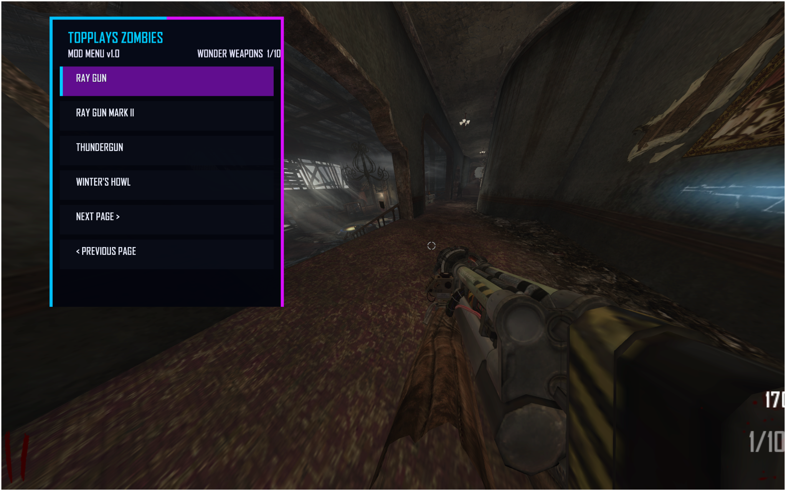

# TopPlays Zombies Mod Menu

A custom mod menu for **Call of Duty: Black Ops II Zombies** running on **Plutonium T6**.

> **Current Version:** v1.0 Development  
# Current Map Support
> **More Zombies maps are coming in future updates.**

TopPlays Zombies is an expanding BO2 Zombies mod menu featuring player options, zombie controls, weapons, custom weapon ports, fun options, settings, and more.

The long-term goal is to support the Black Ops II Zombies map lineup while continuing to add weapons, features, improvements, and custom content.

---

# Current Map Support

### Currently Supported

- Plutonium T6
- Black Ops II Zombies
- DLC5
- `zm_theater`

**The current version is built and tested for `zm_theater` only.**

### Coming Later

Support for additional Black Ops II Zombies maps is planned for future updates.

Do not expect the current DLC5 release to work correctly on other maps yet.

---

## Features

TopPlays Zombies currently includes:

- Player Mods
- Weapon Mods
- Zombie Mods
- Points Options
- Fun Mods
- Menu Settings
- Multi-page Give Weapon menu
- Wonder Weapons
- Pistols
- SMGs
- Assault Rifles
- Shotguns
- LMGs
- Sniper Rifles
- Launchers
- Special Weapons
- Custom weapon integrations

More options are being added as development continues.

---

## Custom Weapon Support

### Winter's Howl

Winter's Howl has been integrated into `zm_theater` with:

- First-person model
- Animations
- Firing sounds
- Reload sounds
- Freeze effects
- Zombie freezing behavior
- Upgraded weapon support

### MP7

The MP7 has also been successfully integrated into Zombies with:

- Base MP7
- Upgraded MP7
- Weapon model
- Animations
- Firing audio
- Zombie damage
- Points support
- Working ammo

More BO2 weapons are planned for future versions.

---

# Menu Controls

The TopPlays Zombies Mod Menu is controlled using your normal in-game controls.

| Action | Control |
|---|---|
| Open Menu | Hold **ADS + Melee** |
| Navigate Up | **ADS** |
| Navigate Down | **Attack / Fire** |
| Select | **Use / Interact** |
| Back | **Melee** |
| Close Menu | **Melee** |

> The menu uses your in-game button bindings, so the exact keyboard/controller button depends on your control settings.

---
# Installation

## Requirements

You need:

- Call of Duty: Black Ops II
- Plutonium T6
- Zombies
- DLC5 / `zm_theater`

## Step 1 - Install Scripts

Copy the included TopPlays script files into:

```text
%LOCALAPPDATA%\Plutonium\storage\t6\usermaps\zm_theater\scripts\zm\
```

## Step 2 - Install Mod Assets

Copy the included TopPlays mod asset files into:

```text
%LOCALAPPDATA%\Plutonium\storage\t6\mods\dlc5\
```

The official release package will contain the files required by that version.

## Step 3 - Launch

Launch **Plutonium T6**, start Zombies, and load DLC5 / `zm_theater`.

The TopPlays Zombies Mod Menu should load with the map.

---

# Important

TopPlays Zombies **v1.0 is currently a DLC5 / `zm_theater` mod**.

Other maps are not officially supported yet.

Map compatibility will be expanded as each map is developed and tested.

---

# Roadmap

Future plans include:

- Support for more BO2 Zombies maps
- More BO2 weapons available in Zombies
- Additional multiplayer weapons converted for Zombies
- More custom weapon integrations
- Expanded Pack-a-Punch support
- Additional menu options
- Additional player mods
- Additional zombie mods
- More fun options
- Menu improvements
- Bug fixes
- Compatibility improvements
- Additional custom content

---

# Development Status

TopPlays Zombies is under active development.

Features may change between versions.

Weapons, maps, and features will be added gradually as they are tested and confirmed working.

---

# Screenshots

## TopPlays Zombies Mod Menu v1.0



*Current TopPlays Zombies menu running on DLC5 / `zm_theater`.*

---

# Credits

## TopPlays Studio

TopPlays Zombies Mod Menu development and integration.

Third-party tools, assets, weapon sources, and community work used by the project will receive appropriate credit as public releases are prepared.

---

# Disclaimer

TopPlays Zombies is a community-created mod project.

It is not affiliated with or endorsed by Activision, Treyarch, Call of Duty, or Plutonium.

Call of Duty and Black Ops are trademarks of their respective owners.
